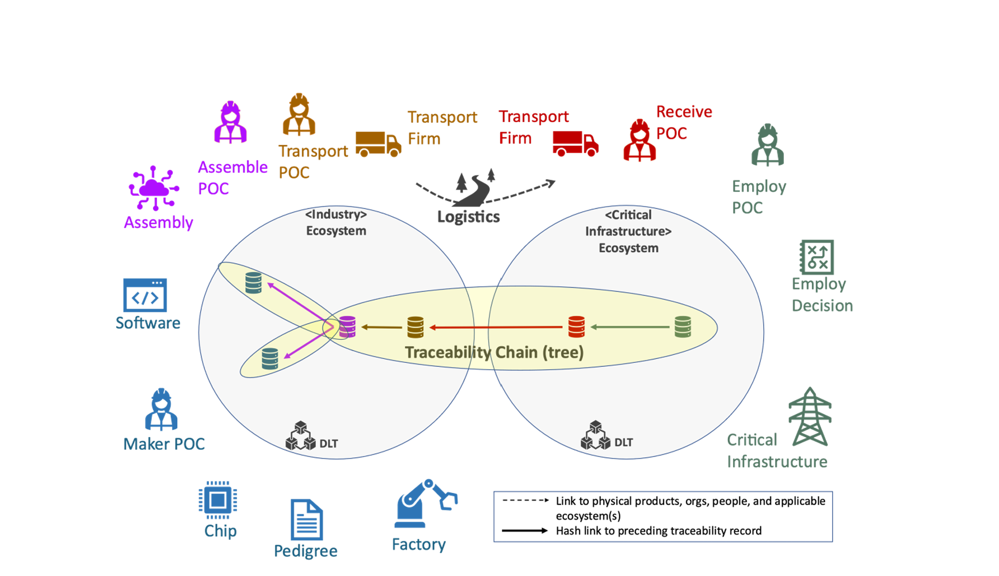
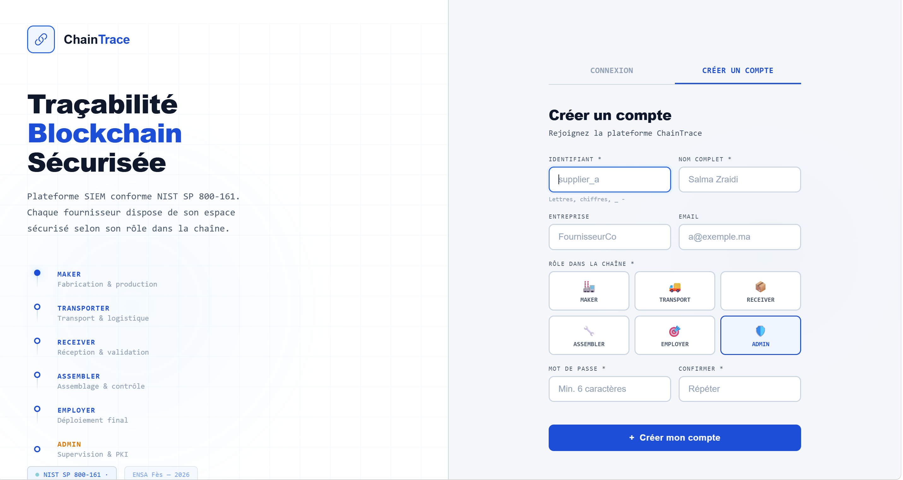
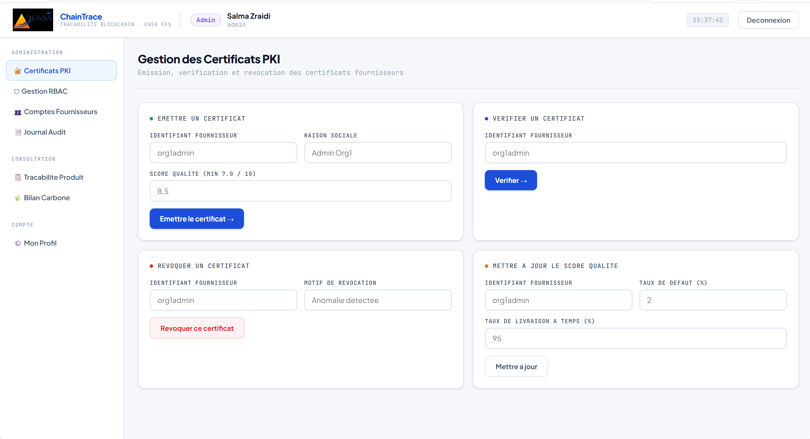
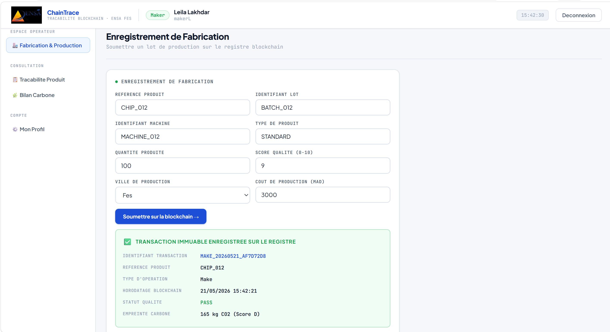
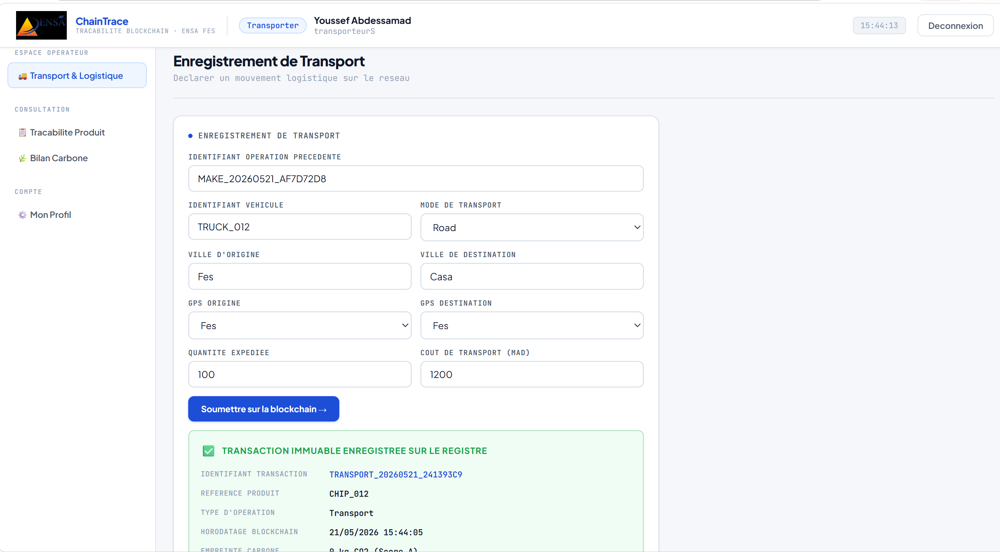
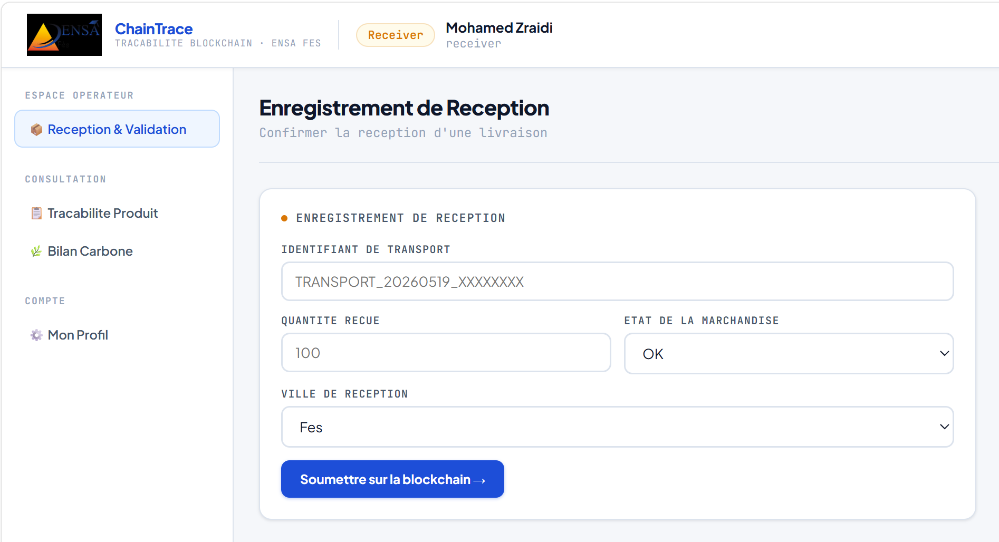
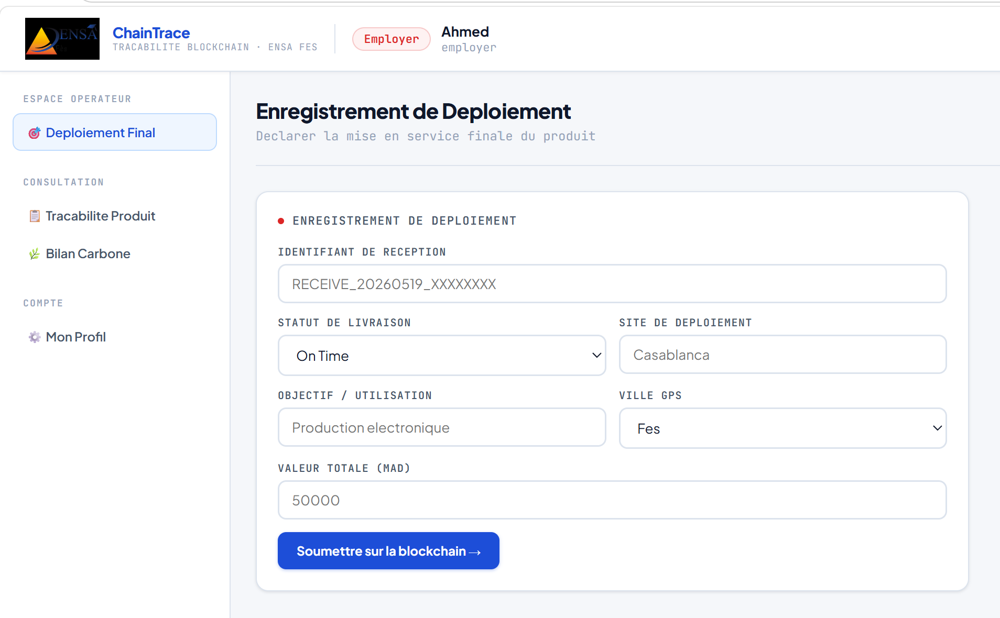
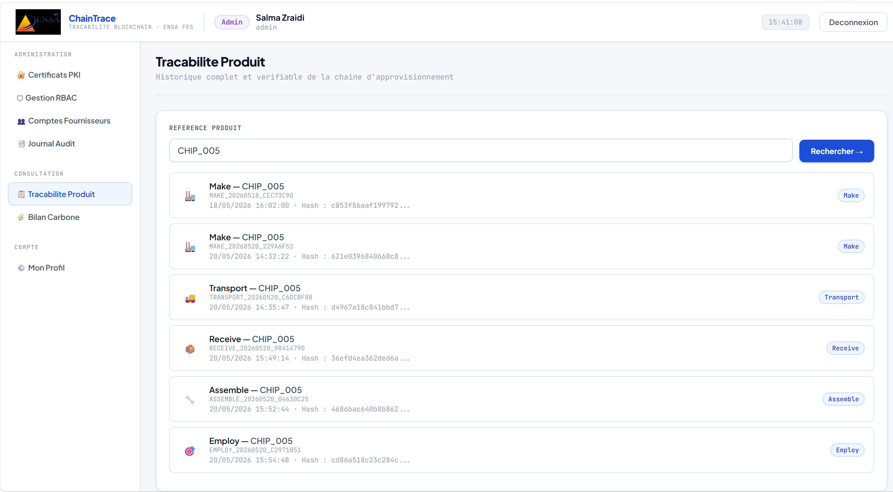
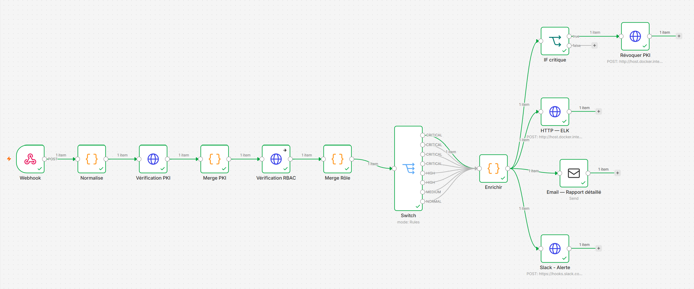

# ChainTrace — Supply Chain Traceability Using Blockchain and Cybersecurity Mechanisms

The platform implements the official architectural specifications of the **National Institute of Standards and Technology (NIST NCCOE - August 2023)** guidelines for securing software and hardware components in critical supply chains.

---

## 🛡️ Problem Statement & NIST Reference Architecture

Modern industrial supply chains face severe opacity, exposing vital systems to counterfeit components, illicit hardware insertions, and compromised software updates.

**ChainTrace** directly addresses these vectors by enforcing multi-layered cryptographic tracking based on the **NIST SP 800-161** risk management framework, organizing the trusted ecosystem into **3 distinct Distributed Ledgers** tracking **5 Core Traceability Records**:

### 🏭 The 3 Interconnected DLT Ecosystems

1. **Microelectronics Ecosystem (MEP):** Dedicated ledger for semiconductor and silicon chip manufacturers.
2. **Operational Technology Ecosystem (OT):** Distributed ledger for industrial equipment builders (assembling hardware chips and firmware).
3. **Critical Infrastructure Ecosystem (CI):** Secure ledger for operators of vital national infrastructures (Energy, Water, Smart Grid, Transport).

### 🔄 Traced Lifecycle Records (The Graph Chain)

The Smart Contracts define and mathematically link 5 structural state records (`TraceRecord`) to form an audit tree:

| Record | Description |
|---|---|
| **Make (Fabrication)** | Initial registration of a physical or software asset (Maker ID, Product ID, quality metrics, and factory origin hashes). |
| **Assemble (Assembly)** | A cryptographic fusion step merging multiple upstream components, forming the vertices of the traceability tree. |
| **Transport** | Transit record mapping data state transfer from a source ecosystem to a destination network. |
| **Receive (Reception)** | Anchoring phase within the destination ecosystem pointing natively back to the source Transport block. |
| **Employ (Utilization)** | Final operational decision (Deployment or Rejection) after executing a full automatic recursive audit of the asset graph. |

---

## 🌐 Global Solution Overview

The diagram below illustrates the full end-to-end architecture of ChainTrace, spanning the 3 DLT ecosystems and all lifecycle traceability records:



---

## 🏗️ Monorepo Directory Architecture

This centralized monorepo orchestrates the full DevSecOps stack:

```text
📦 chaintrace-main-project
 ┣ 📂 chaintrace-blockchain-core    # Hyperledger Fabric Smart Contracts (TypeScript Chaincode)
 ┣ 📂 chaintrace-api-gateway        # Express.js API Gateway & Professional Web Interface (Light Mode UI)
 ┣ 📂 chaintrace-auth-server        # PKI & RBAC Identity Provider with Local SQLite Audit Logs
 ┣ 📂 chaintrace-siem-soar          # Docker Orchestration for Logstash, Elasticsearch & Kibana (ELK Stack)
 ┗ 📜 chaintrace-soar-workflow.json # Central SOAR n8n Automation Engine Graph (Active Mitigation)
```

---

## 💻 Platform Screenshots

### Login Page



### Admin Dashboard



### Fabrication — Make Record



### Transport Record



### Reception Record



### Employ (Utilization) — Final Audit Decision



### Full Traceability View



---

## 🔐 Advanced Security Engineering & Active Mitigation (SOAR)

- **RBAC & Cryptographic Assurance:** Access control maps strictly to NIST roles (*Maker, Assembler, Transporter, Receiver, Employer*). Transactions are signed via ECDSA keys linked to verified X.509 certificates.
- **Closed-Loop SecOps Control:** Network and ledger logs are parsed in real time by **Logstash** and aggregated into **Elasticsearch**.
- **Automated Threat Containment:** If a supplier commits a compromised artifact or fails an automated NIST compliance quality threshold, the **SOAR (n8n)** engine flags the anomaly, transmits a critical response alert to **Slack**, and pushes an automated gRPC instruction to the Gateway to **instantly revoke the actor's cryptographic identity certificate**. Any further transaction attempts by this node are dynamically rejected by the Blockchain consensus layer.

### 🔄 SOAR Active Response Workflow (n8n)



> Automated threat containment pipeline: ELK alert → n8n → Slack notification → Certificate revocation

---

## 🚀 Deployment & Orchestration Guide

To initialize and launch the multi-service architecture locally, execute the commands in the following structural order:

### 1. Initialize the SOC Logging Infrastructure (SIEM)

Start the central log aggregation stack to capture all Hyperledger Fabric transactions from block zero:

```bash
cd chaintrace-siem-soar
docker-compose up -d
```

### 2. Launch the PKI Identity Server (Authentication)

Spin up the centralized authentication engine enforcing local SQLite audit logs and secure session tokens:

```bash
cd chaintrace-auth-server
npm install
node auth-server.js
```

### 3. Start the API Gateway & Supervision Dashboard

Run the central gateway and the institutional user interface mapped to the underlying nodes:

```bash
cd chaintrace-api-gateway
npm install
npx ts-node src/app.ts
```

### 4. Inject the SOAR Active Response Workflow

1. Access your local **n8n** automation console dashboard.
2. Open the top-right options grid, select **Import from file**, and upload the root `chaintrace-soar-workflow.json` file.
3. *(Security Notice: Remember to update the Slack webhook placeholder string with your own credentials, ensuring compliance with Git Push Protection protocols.)*
